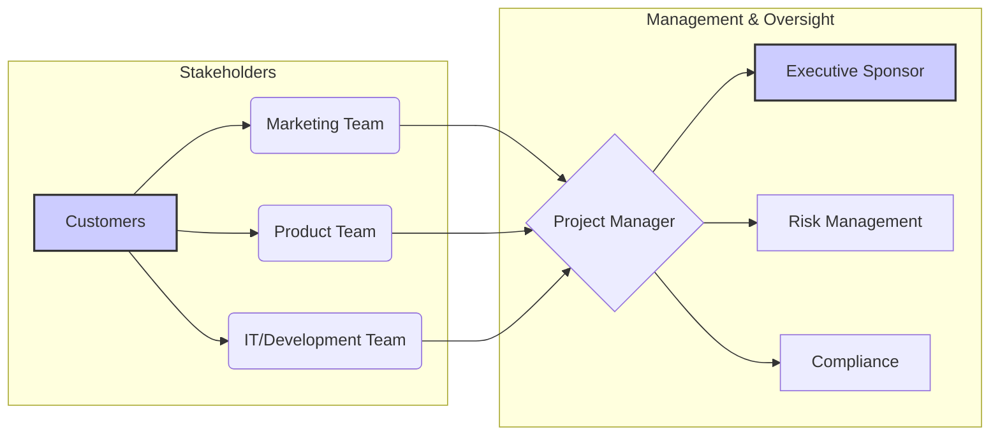

# 1. Stakeholder Map

```mermaid
graph LR
    A[Customers] --> B(Marketing Team);
    A --> C(Product Team);
    A --> D(IT/Development Team);
    B --> E{Project Manager};
    C --> E;
    D --> E;
    E --> F[Executive Sponsor];
    E --> G[Risk Management];
    E --> H[Compliance];

    subgraph "Stakeholders"
        A; B; C; D;
    end
    subgraph "Management & Oversight"
        E; F; G; H;
    end

    style A fill:#ccf,stroke:#333,stroke-width:2px
    style F fill:#ccf,stroke:#333,stroke-width:2px
```