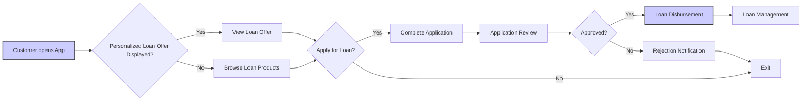

# Process Flow of the New Loan Uptake Journey

```mermaid
graph LR
    A[Customer opens App] --> B{Personalized Loan Offer Displayed?};
    B -- Yes --> C[View Loan Offer];
    B -- No --> D[Browse Loan Products];
    C --> E{Apply for Loan?};
    D --> E;
    E -- Yes --> F[Complete Application];
    E -- No --> G[Exit];
    F --> H[Application Review];
    H --> I{Approved?};
    I -- Yes --> J[Loan Disbursement];
    I -- No --> K[Rejection Notification];
    J --> L[Loan Management];
    K --> G;
    style A fill:#ccf,stroke:#333,stroke-width:2px
    style J fill:#ccf,stroke:#333,stroke-width:2px


```