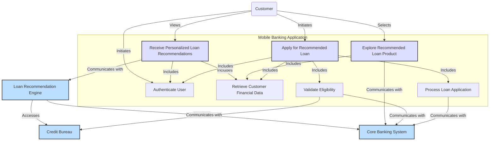

The bank aims to leverage its rich customer data to address the low uptake of loan products through its mobile banking app. The core idea is to personalize loan recommendations, making them more visible and relevant to individual customers, thereby driving higher conversion rates.

As a Use Case Analyst, I will develop use case diagrams and detailed scenarios for the following three key cases:

1.  **Receive Personalized Loan Recommendations:** How the customer views relevant loan suggestions upon logging into the app.
2.  **Explore Recommended Loan Product:** How the customer delves into the details of a specific recommended loan.
3.  **Apply for Recommended Loan:** How the customer initiates and completes an application for a recommended loan product.

---

## 1. Use Case Diagram

### Actors:

*   **Customer:** The primary user of the mobile banking app.
*   **Loan Recommendation Engine (System):** The automated system responsible for analyzing data, generating, and serving personalized loan recommendations.
*   **Core Banking System (System):** Manages customer accounts, transactions, and existing loan data.
*   **Credit Bureau (External System):** Provides external credit scores and history.

### System Boundary:

The Mobile Banking Application within the Bank's IT Ecosystem.

### Use Case Diagram:

**Explanation of Relationships:**

*   **`<<includes>>`:**
    *   `Receive Personalized Loan Recommendations` *includes* `Authenticate User` and `Retrieve Customer Financial Data`.
    *   `Apply for Recommended Loan` *includes* `Authenticate User`, `Retrieve Customer Financial Data`, `Validate Eligibility`, and `Process Loan Application`.
*   **Communication Links:**
    *   `Loan Recommendation Engine` interacts with `Core Banking System` and `Credit Bureau` to gather data.
    *   `Validate Eligibility` and `Process Loan Application` interact with `Core Banking System` and `Credit Bureau`.

---

## 2. Detailed Use Case Scenarios

### Use Case 1: Receive Personalized Loan Recommendations

*   **Use Case ID:** UC-L001
*   **Use Case Name:** Receive Personalized Loan Recommendations
*   **Actors:** Customer, Loan Recommendation Engine (System), Core Banking System, Credit Bureau
*   **Description:** This use case describes how the mobile banking app displays personalized and relevant loan product recommendations to the customer based on their profile, financial behavior, and eligibility.
*   **Preconditions:**
    *   Customer has an active account with the bank.
    *   Customer has downloaded and registered for the mobile banking app.
    *   The Loan Recommendation Engine is operational and has recent customer data.
*   **Triggers:**
    *   Customer logs into the mobile banking app.
    *   Customer navigates to the "Loans" or "Dashboard" section of the app.
*   **Basic Flow (Main Success Scenario):**

    1.  **Customer Logs In:** The Customer opens the mobile banking app and successfully logs in (UC-L004: Authenticate User).
    2.  **System Initiates Data Retrieval:** The Mobile Banking App sends a request to the Loan Recommendation Engine to fetch personalized loan recommendations for the logged-in customer.
    3.  **Loan Recommendation Engine Gathers Data:**
        *   The **Loan Recommendation Engine** queries the **Core Banking System** to retrieve the customer's:
            *   Basic profile (age, occupation, address, existing relationships with the bank).
            *   Account balances (savings, current accounts).
            *   Transaction history (salary credits, utility payments, fund transfers, large purchases, investment activity – as indicated by the prompt).
            *   Existing loan products and repayment history.
        *   The **Loan Recommendation Engine** queries the **Credit Bureau** (e.g., CIBIL) to retrieve the customer's external credit score and history.
        *   The **Loan Recommendation Engine** also considers the customer's *mobile app engagement data* (e.g., features used, pages visited, search queries within the app related to loans, time spent on specific sections).
    4.  **Loan Recommendation Engine Processes Data:** The **Loan Recommendation Engine** uses its algorithms (e.g., collaborative filtering, content-based filtering, rule-based systems, machine learning models) to:
        *   Assess the customer's financial health and capacity.
        *   Identify potential life events or needs based on transaction patterns (e.g., frequent utility payments might suggest a need for a home loan, large transfers for education might suggest an educational loan).
        *   Match the customer's profile and inferred needs against available loan products and their eligibility criteria.
        *   Prioritize and rank suitable loan products for the customer.
    5.  **System Displays Recommendations:** The Mobile Banking App receives the ranked list of personalized loan recommendations from the Loan Recommendation Engine. It displays these prominently on the customer's dashboard or a dedicated "Loan Offers" section. The display includes:
        *   Loan product name (e.g., "Home Loan," "Personal Loan").
        *   Key benefit/call to action (e.g., "Pre-approved up to ₹X," "Special Rate for You").
        *   A clear "Learn More" or "Apply Now" button for each recommendation.
    6.  **Customer Reviews Recommendations:** The Customer views the displayed loan recommendations.
*   **Alternative Flows:**
    *   **AF-1.1: No Suitable Recommendations:**
        *   Step 4: If the Loan Recommendation Engine identifies no suitable loan products based on eligibility or risk assessment, it informs the Mobile Banking App.
        *   Step 5: The Mobile Banking App displays a message such as "No personalized loan offers available at this time. Please check back later." or "Explore our full range of loan products."
    *   **AF-1.2: System Error/Data Unavailable:**
        *   Step 3: If any external system (Core Banking, Credit Bureau) or the Loan Recommendation Engine is temporarily unavailable, the system notifies the customer.
        *   Step 5: The Mobile Banking App displays an error message: "Unable to fetch recommendations. Please try again later."
*   **Postconditions:**
    *   Customer has viewed personalized loan recommendations on their mobile app.
    *   Customer has acknowledged the absence of recommendations (if AF-1.1 occurs).
*   **Business Rules:**
    *   Loan eligibility criteria must be strictly adhered to by the recommendation engine.
    *   Credit score checks must comply with regulatory requirements.
    *   Data privacy and consent for using customer data must be maintained.
    *   Recommendations must be regularly refreshed to reflect current offers and customer status.
*   **Data Sources Utilized for Personalization:**
    *   **Core Banking System:** Customer demographics (age, income, occupation), existing relationships, account balances, transaction history (salary credits, utility payments, fund transfers, large purchases, investment activity), existing loan products, repayment history.
    *   **Credit Bureau:** External credit score, credit history, existing loans with other institutions.
    *   **Mobile App Analytics:** App usage patterns, frequently used features (utility payments, fund transfers, balance inquiries), pages visited, search queries within the app, time spent on different sections.
    *   **Loan Product Database:** Details of all available loan products, their eligibility criteria, interest rates, and features.

---

### Use Case 2: Explore Recommended Loan Product

*   **Use Case ID:** UC-L002
*   **Use Case Name:** Explore Recommended Loan Product
*   **Actors:** Customer, Mobile Banking App, Core Banking System
*   **Description:** This use case describes how a customer, after seeing a personalized loan recommendation, can view more detailed information about that specific loan product within the app.
*   **Preconditions:**
    *   Customer has received personalized loan recommendations (UC-L001 has been successfully executed).
    *   The specific recommended loan product is still available.
*   **Triggers:**
    *   Customer taps on a specific loan recommendation displayed in the app.
    *   Customer taps on a "Learn More" or "Details" button associated with a recommendation.
*   **Basic Flow (Main Success Scenario):**

    1.  **Customer Selects Recommendation:** The Customer taps on a specific personalized loan recommendation (e.g., "Home Loan - Pre-approved up to ₹50 Lakhs") on their mobile app screen.
    2.  **System Fetches Loan Details:** The Mobile Banking App sends a request to the Core Banking System or a dedicated product information service to retrieve the comprehensive details of the selected loan product.
    3.  **System Displays Loan Details:** The Mobile Banking App displays a dedicated screen with detailed information about the selected loan product. This information includes:
        *   **Product Overview:** Detailed description, purpose, key benefits.
        *   **Personalized Eligibility Highlights:** Explicitly stating *why* this loan is suitable for *them* (e.g., "Based on your salary," "Eligible due to your excellent credit score").
        *   **Interest Rates:** Applicable interest rates (fixed/floating), any special rates offered.
        *   **Loan Tenure Options:** Available repayment periods.
        *   **Loan Amount Range:** Minimum and maximum loan amounts.
        *   **Fees and Charges:** Processing fees, foreclosure charges, other hidden costs.
        *   **Required Documents:** A list of documents needed for application.
        *   **FAQs:** Common questions and answers related to the loan.
        *   **Pre-filled Information Display:** If applicable, display potential pre-filled values based on customer data (e.g., maximum eligible loan amount, estimated EMI).
    4.  **Customer Reviews Details:** The Customer reviews the detailed information, assessing its suitability and terms.
    5.  **Customer Takes Action:** From this screen, the Customer can:
        *   Tap "Apply Now" (proceed to UC-L003).
        *   Go back to view other recommendations or other sections of the app.
        *   Contact customer support for more information.
*   **Alternative Flows:**
    *   **AF-2.1: Product No Longer Available:**
        *   Step 2: If the selected loan product has been withdrawn or is temporarily unavailable, the system notifies the customer.
        *   Step 3: The Mobile Banking App displays a message: "This loan product is currently unavailable. Please explore other options."
    *   **AF-2.2: Network/System Error:**
        *   Step 2: If there's a network error or the system fails to retrieve details, an error message is displayed.
        *   Step 3: The Mobile Banking App displays: "Unable to retrieve loan details. Please try again later."
*   **Postconditions:**
    *   Customer has viewed the detailed information for a specific recommended loan product.
    *   Customer is better informed about the loan's features and requirements.
*   **Business Rules:**
    *   All displayed information must be accurate and up-to-date.
    *   Personalized information (e.g., max eligible amount) must be clearly distinguished from general product information.
    *   Disclosures about terms and conditions must be prominent.
*   **Data Sources Utilized for Exploration:**
    *   **Loan Product Database:** Comprehensive details of the selected loan product.
    *   **Core Banking System:** Customer's current eligibility data to display personalized highlights (e.g., pre-approved amount).

---

### Use Case 3: Apply for Recommended Loan

*   **Use Case ID:** UC-L003
*   **Use Case Name:** Apply for Recommended Loan
*   **Actors:** Customer, Mobile Banking App, Core Banking System, Credit Bureau
*   **Description:** This use case describes how a customer initiates and completes the application process for a recommended loan product through the mobile banking app, leveraging pre-filled data for convenience.
*   **Preconditions:**
    *   Customer has viewed and explored a recommended loan product (UC-L002 has been successfully executed).
    *   Customer has decided to proceed with the application.
*   **Triggers:**
    *   Customer taps the "Apply Now" button on the loan details screen or the recommendation card.
*   **Basic Flow (Main Success Scenario):**

    1.  **Customer Initiates Application:** The Customer taps "Apply Now" for a specific recommended loan product.
    2.  **System Initiates Application Process:** The Mobile Banking App initiates the loan application workflow.
    3.  **System Pre-fills Application Form:** The Mobile Banking App, by integrating with the Core Banking System, pre-fills as many fields as possible on the loan application form using existing customer data (e.g., name, address, date of birth, contact details, account numbers, employment details, income, existing loan obligations).
    4.  **Customer Reviews and Provides Additional Information:** The Customer reviews the pre-filled information for accuracy. They then manually enter any remaining required information (e.g., specific loan amount desired, desired tenure, purpose of loan if not auto-inferred, nominee details, or details not available in bank records).
    5.  **System Prompts Document Upload (if needed):** If certain documents are required and not already on file (e.g., updated income proof, property documents for home loan), the Mobile Banking App prompts the customer to upload scanned copies or photos directly through the app.
    6.  **System Performs Real-time Eligibility Check (UC-L006: Validate Eligibility):** As the customer fills out or confirms details, the system performs ongoing, real-time eligibility checks leveraging:
        *   **Core Banking System:** Internal credit history, existing bank relationships, current balances, transaction patterns.
        *   **Credit Bureau:** External credit score and detailed credit report.
        *   The system may provide immediate feedback on eligibility or suggest alternative loan amounts/tenures.
    7.  **Customer Confirms & Submits Application:** The Customer reviews the final application summary, accepts the terms and conditions, and taps "Submit."
    8.  **System Processes Application (UC-L007: Process Loan Application):**
        *   The Mobile Banking App sends the completed application to the Core Banking System.
        *   The Core Banking System conducts a final automated credit assessment and risk profiling.
        *   If approved, the loan application status is updated, and the customer receives an immediate confirmation message. If further manual review is needed, the status is updated accordingly.
    9.  **System Confirms Submission/Approval:** The Mobile Banking App displays a confirmation message indicating successful application submission or preliminary approval, along with a reference number and next steps. An SMS/email confirmation is also sent.
*   **Alternative Flows:**
    *   **AF-3.1: Insufficient Information/Missing Documents:**
        *   Step 5: If mandatory fields are left blank or documents are missing, the system prevents submission and highlights the required fields/documents.
        *   Step 7: Customer cannot submit until all mandatory fields are completed and documents uploaded.
    *   **AF-3.2: Eligibility Not Met (Real-time Rejection):**
        *   Step 6: If the real-time eligibility check fails (e.g., credit score too low, DTI too high for requested amount), the system immediately informs the customer about the rejection or suggests a lower amount/different product, explaining the reason where possible.
        *   Step 8: Application is not processed further, or a revised application is prompted.
    *   **AF-3.3: System Error during Submission:**
        *   Step 8: If a technical error occurs during submission, the system notifies the customer.
        *   Step 9: The Mobile Banking App displays an error message and advises the customer to try again or contact support.
*   **Postconditions:**
    *   Loan application is successfully submitted to the bank for processing.
    *   Customer receives a confirmation of their application status.
    *   (If approved immediately) Loan sanction process is initiated.
*   **Business Rules:**
    *   All regulatory KYC (Know Your Customer) and AML (Anti-Money Laundering) requirements must be met during the application process.
    *   Data security and privacy must be maintained for sensitive financial information.
    *   Automated decision-making for loan approval must comply with bank's credit policies and regulatory guidelines.
    *   Error messages should be clear and actionable.
*   **Data Sources Utilized for Application:**
    *   **Core Banking System:** All pre-fillable customer data (demographics, income, existing accounts, other loans, transaction history), internal credit scores.
    *   **Credit Bureau:** External credit score and comprehensive credit report for eligibility validation.
    *   **Loan Product Database:** Specific fields and document requirements for the selected loan product.
    *   **Document Management System:** For storing uploaded customer documents.

---

This comprehensive analysis provides a clear roadmap for the bank to implement data-driven personalization for loan product uptake within its mobile banking application, focusing on the customer journey from discovery to application.